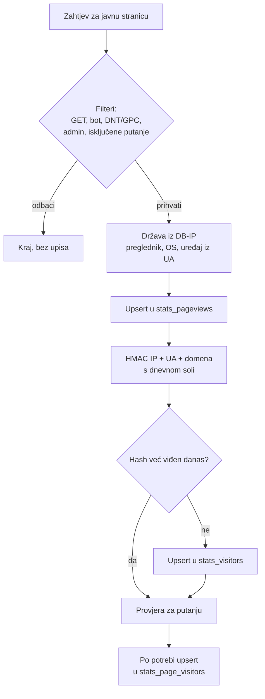

# Statistika posjeta za PHP CMS – specifikacija (bazična+)

2026-09-18 · @Someone

## Ideja i načela

Modul daje adminu pregled posjeta s mapom svijeta, a radi u potpunosti lokalno, bez kolačića i bez spremanja osobnih podataka. Model je isti kao kod Plausiblea i sličnih alata: IP adresa se koristi samo u trenutku zahtjeva, a trajno se čuvaju isključivo agregirane brojke.

- **Lokalno:** nema vanjskih servisa za analitiku ni CDN-a; geolokacija iz lokalne baze, sve biblioteke hostane uz CMS.
- **Cookieless:** ništa se ne sprema na uređaj posjetitelja, pa nije potreban banner za privolu.
- **Agregirano:** baza sadrži samo brojila po danu i dimenzijama, bez zapisa po posjetitelju.
- **Lagano:** praćenje ne smije primjetno usporiti stranicu; bez frameworka i teških ovisnosti.
- **Lijepo i praktično:** dashboard usklađen s adminom, responzivan, s tamnim načinom rada.
- **Prenosivo:** podaci se mogu izvesti u formatu koji čita Plausible i u vlastitom formatu.

## Opseg

Bazična+ varijanta prati preglede i dnevne jedinstvene posjetitelje po stranici, državi, izvoru, uređaju, pregledniku i OS-u. Sesije se ne prate, pa nema metrika koje ovise o povezivanju više pregleda istog posjetitelja.

| Uključeno | Namjerno izostavljeno |
| --- | --- |
| Pregledi (pageviews) | Sesije i broj posjeta |
| Dnevni jedinstveni posjetitelji, ukupno i po stranici | Trajanje posjeta |
| Stranice, izvori prometa (domena), države | Bounce rate |
| Uređaj, preglednik, operativni sustav | Ulazne i izlazne stranice |
| Mapa svijeta po državama | Lokacija na razini grada |
| Brojanje 404 stranica (opcionalno) | Realtime prikaz |
| Export u Plausible CSV i nativni format | Praćenje događaja i konverzija |

Arhitektura ostavlja prostor za kasnije dodavanje sesija bez promjene postojećih tablica.

## Biblioteke i resursi

Modul ne koristi Composer. PHP komponente se isporučuju kao vendorirane kopije u `lib/` s vlastitim malim autoloaderom, a ono što je dovoljno jednostavno piše se sami. Sve se hosta lokalno; jedini vanjski zahtjev je mjesečno preuzimanje nove DB-IP baze na serveru, bez podataka posjetitelja.

| Komponenta | Namjena | Licenca | Kako dolazi |
| --- | --- | --- | --- |
| MaxMind DB Reader (pure PHP) | Čitanje `.mmdb` baze | Apache 2.0 | Vendorirano u `lib/mmdb/`, bez ovisnosti |
| DB-IP IP to Country Lite (`.mmdb`) | Država iz IP adrese | CC BY 4.0 | Preuzima web installer ili admin gumb |
| Vlastiti UA parser (\~100 linija) | Obitelj preglednika, OS, tip uređaja | – | Dio modula; dovoljan jer se ne prate verzije |
| Popis bot obrazaca | Prepoznavanje botova | MIT (izvor Crawler-Detect) | Data datoteka u `data/bots.php`, osvježiva |
| jsvectormap + `world.js` | Mapa po državama | MIT | Lokalno u `admin/assets/` |
| Chart.js | Graf trenda | MIT | Lokalno; alternativa čisti SVG |
| flag-icons (samo potrebni SVG-ovi) | Zastavice u tablici država | MIT | Lokalno |
| PHP ekstenzije `pdo`, `json` | Baza i JSON endpoint | – | Provjerava installer |
| PHP ekstenzija `zip` | ZIP export za Plausible | – | Opcionalno; bez nje se nude pojedinačni CSV-ovi |
|  |  |  |  |

- `lib/` sadrži `THIRD-PARTY.md` s licencama i verzijama vendoriranih datoteka, radi urednog ažuriranja.
- Web installer provjerava ekstenzije, kreira tablice i ponudi preuzimanje DB-IP baze; ako preuzimanje ne uspije, dopušta ručni upload `.mmdb` datoteke.
- Alternativa bez ikakve vanjske PHP komponente: DB-IP CSV se pri instalaciji pretvori u vlastiti binarni indeks raspona uz pretraživanje polaženjem. Brže je za jednu dodatnu skriptu, ali traži vlastiti konverter i gubi drop-in ažuriranje `.mmdb` datoteke.

## Model podataka

Trajne tablice sadrže samo brojila po danu i dimenzijama; svaki upis je upsert koji povećava brojilo. Privremene tablice služe samo za prepoznavanje jedinstvenih posjetitelja i brišu se pri prvom zahtjevu novog dana.

| Tablica | Vrsta | Ključ (dimenzije) | Brojila | Trajanje |
| --- | --- | --- | --- | --- |
| `stats_pageviews` | Agregat | dan, putanja, država, domena izvora, uređaj, preglednik, OS | pregledi | Prema postavci roka čuvanja |
| `stats_visitors` | Agregat | dan, država, domena izvora, uređaj, preglednik, OS | jedinstveni posjetitelji | Prema postavci roka čuvanja |
| `stats_page_visitors` | Agregat | dan, putanja | jedinstveni posjetitelji | Prema postavci roka čuvanja |
| `stats_404` | Agregat (opcionalno) | dan, putanja | broj zahtjeva | Prema postavci roka čuvanja |
| `stats_seen` | Privremena | dan, hash, putanja (prazna za globalno) | – | Do kraja dana |
| `stats_salt` | Privremena | dan | sol | Do kraja dana |

- Kod `stats_visitors` izvor, uređaj i ostale dimenzije uzimaju se s prvog pregleda posjetitelja u danu.
- Preglednik se sprema kao obitelj (Chrome, Firefox, Safari, Edge, Ostalo), OS kao obitelj (Windows, macOS, iOS, Android, Linux, Ostalo), bez verzija.
- Država je ISO 3166-1 alpha-2 kod, s oznakom `--` za nepoznato.
- Putanja je bez query stringa i fragmenta, normalizirana (završna kosa crta, mala slova ako CMS to podržava), skraćena na 255 znakova.

## Praćenje posjeta

Svaki pregled prolazi kroz filtere, obogaćuje se državom i podacima o uređaju, upisuje kao pregled, a dnevni hash odlučuje je li riječ o novom jedinstvenom posjetitelju.

IP adresa nakon ovog toka nigdje ne ostaje zapisana.

### Načini rada

- **Server-side (zadano):** praćenje u front controlleru, izvršeno nakon slanja odgovora (`fastcgi_finish_request()`, uz fallback). Bez JavaScripta. U prvoj verziji jedini način rada.
- **JS beacon:** ostavljen za kasnije, kad CMS dobije full-page cache; za keširane stranice PHP se ne izvršava, pa server-side praćenje tada ne vidi te preglede. Sitna skripta (cilj < 1 KB, `defer`) nakon učitavanja šalje samo putanju i referrer preko `navigator.sendBeacon`; endpoint vraća `204 No Content`. Ne šalje signal angažmana.

### Filtriranje

- Prate se samo uspješni GET zahtjevi za javne stranice; ne admin, ne asseti, ne preview, ne feedovi.
- Botovi preko `crawler-detect`; prazan User-Agent se odbacuje.
- Poštuju se DNT i Sec-GPC (uključeno po defaultu).
- Opcionalno se isključuju prijavljeni administratori i putanje s popisa (wildcard).
- 404 odgovori se, ako je uključeno, broje samo u `stats_404`.

### Jedinstveni posjetitelji

- Ključ je HMAC-SHA256 od IP adrese, User-Agenta i domene, s nasumičnom dnevnom soli; sprema se skraćen na 16 bajtova.
- Prvi zahtjev novog dana generira novu sol i briše jučerašnju sol i sve jučerasnje hasheve. Cron nije potreban.
- Isti posjetitelj idući dan broji se kao novi; povezivanje kroz dane je namjerno nemoguće.

### Izvor i IP

- Referrer se svodi na domenu bez `www.`; vlastita domena i prazan referrer znače "direktno".
- IP se čita iz `REMOTE_ADDR`, a iz proxy headera samo ako zahtjev dolazi s adrese na popisu pouzdanih proxyja (npr. Cloudflare).

## Lokacija: regija i grad (nadogradnja)

Za stranice usmjerene na vlastito tržište podatak o državi ništa ne govori, jer je gotovo sav promet domaći. Zato se uvodi finija granularnost: uz državu se bilježe regija (`subdivision`) i grad, a dashboard prikazuje razinu koja je korisna za konkretnu stranicu.

### Baza

- DB-IP **IP to City Lite** (`.mmdb`), CC BY 4.0, ista atribucija i isti vendorirani reader kao dosad.
- Veličina je oko 121 MB raspakirano, odnosno oko 19 MB gzipano, naspram 8 MB za country bazu. Reader čita datoteku pomicanjem po njoj, pa memorija nije problem; problem su disk i preuzimanje.
- Zapis daje ISO kod države, naziv i kod regije, naziv grada te približne koordinate, koje služe za mjehuriće na karti.
- Country baza ostaje podržana kao lakša opcija; razina lokacije je postavka, a ne fiksna odluka.

### Model podataka

- Nova tablica `stats_geo` s ključem (dan, država, regija, grad) i brojilima (jedinstveni posjetitelji, pregledi). Grad se namjerno **ne** dodaje u `stats_pageviews`, jer bi kombinacija putanje i grada umnožila broj redaka.
- Uz grad se sprema zaokružena koordinata (dvije decimale) za prikaz na karti; koordinate dolaze iz baze, ne od posjetitelja.
- Nepoznata regija ili grad spremaju se kao prazna vrijednost i prikazuju kao “Nepoznato”.
- Nazivi gradova normaliziraju se na englesku varijantu iz baze, uz kod države i regije kao dio ključa, jer postoji više gradova istog imena.

### Prikaz na dashboardu

- **Automatski odabir pogleda:** ako jedna država nosi više od 70 posto prometa u razdoblju, karta se otvara na toj državi, inače na svijetu. Prebacivanje je ručno, preko izbornika Svijet / Država.
- **Mjehurići po gradovima:** gradovi se crtaju kao markeri veličine prema broju posjetitelja. Radi za svaku državu, bez posebne vektorske karte.
- **Regije kao choropleth** koriste se samo ako za tu državu postoji karta u jsvectormap formatu; inače ostaju mjehurići i tablica.
- Nove tablice **Regije** i **Gradovi** uz postojeću tablicu država; klik na redak filtrira dashboard kao i ostali filteri.
- Ispod karte stoji napomena o točnosti: lokacija je približna, a kod mobilnih mreža i CGNAT-a često pokaže sjedište operatera umjesto stvarnog grada.

### Privatnost

Grad je osjetljiviji podatak od države, pa uz njega idu dodatne mjere:

- **Prag prikaza (k-anonimnost)**, uključen po defaultu na razini grada: gradovi s manje od 5 posjetitelja u razdoblju prikazuju se skupno kao “Ostalo” unutar svoje regije.
- **Kraći rok za detalj:** gradska razina čuva se npr. 3 mjeseca, nakon čega se redak sažima na regiju, a kasnije na državu. Rok je postavka.
- Grad se ne kombinira s putanjom ni u jednom prikazu ni u exportu, čime se izbjegava profil pojedinog posjetitelja.
- Razina lokacije je postavka s tri vrijednosti: **Država** (zadano), **Regija**, **Grad**. Promjena vrijedi od trenutka uključenja, bez retroaktivne obrade.
- Uz razinu grada politika privatnosti dobiva rečenicu o obradi približne lokacije; generirani tekst se mijenja prema postavci.

### Instalacija i migracija

- Web installer i admin nude izbor baze; preuzimanje od 121 MB radi se u komadima, s nastavkom nakon prekida i provjerom kontrolne sume.
- Ako hosting ne dopušta preuzimanje ili nema dovoljno prostora, moguć je ručni upload datoteke ili ostanak na country bazi.
- Postojeći podaci ostaju netaknuti; stariji dani nemaju regiju ni grad i prikazuju se kao “Nepoznato”.
- Plausible export zadržava razinu države; nativni export dobiva i `stats_geo`, uz primijenjen prag prikaza.

## Dashboard

Puna stranica statistike u adminu, plus mali widget na početnoj stranici admina. Podaci dolaze s internog JSON endpointa zaštićenog admin autentikacijom i CSRF-om.

### Razdoblje i filteri

- Razdoblja: danas, 7 dana, 30 dana, ovaj mjesec, prošli mjesec, 12 mjeseci, proizvoljni raspon.
- Klik na državu, stranicu, izvor, uređaj, preglednik ili OS postavlja filter za cijeli dashboard.
- Aktivni filteri prikazani su kao chipovi koji se mogu ukloniti; stanje se čuva u URL-u pa se pogled može spremiti kao bookmark.
- Gdje agregatna struktura ne podržava kombinaciju filtera (npr. jedinstveni posjetitelji po stranici i državi), prikaz to jasno navodi umjesto netočnog broja.

### Prikazi

- **KPI kartice:** jedinstveni posjetitelji, pregledi, pregledi po posjetitelju, udio mobilnih; svaka s promjenom u odnosu na prethodno razdoblje (postotak i strelica).
- **Graf trenda:** posjetitelji i pregledi po danu, za 12 mjeseci po tjednu; tooltip s točnim brojkama.
- **Mapa svijeta:** choropleth po jedinstvenim posjetiteljima, legenda skale, tooltip s državom, brojem i postotkom.
- **Tablice:** najposjećenije stranice (pregledi i posjetitelji), izvori prometa, države sa zastavicama, uređaji, preglednici, operativni sustavi, opcionalno 404 stranice.
- Svaka tablica ima horizontalne trake udjela, top 10 i opciju "prikaži sve".
- **Widget na početnoj:** posjetitelji danas i sparkline za 7 dana, s linkom na punu statistiku.

### Dizajn i upotrebljivost

- Usklađen s postojećim adminom; čist raspored kartica, dovoljno bjeline, jedna akcentna boja.
- Responzivan (mapa i tablice upotrebljivi na mobitelu), podržava tamni način rada.
- Stanja učitavanja (skeleton), prazna stanja i greške riješeni porukom i uputom, uključujući nedostajuću DB-IP bazu.
- Brojevi i datumi formatirani za hr-HR.
- Pristupačnost: kontrasti, vidljiv fokus, navigacija tipkovnicom, tekstualna alternativa za graf i mapu (tablica država služi kao alternativa mapi).

## Postavke

Sve postavke su u jednoj admin stranici modula, s razumnim zadanim vrijednostima tako da modul radi odmah nakon instalacije.

| Postavka | Zadano | Opis |
| --- | --- | --- |
| Praćenje uključeno | Da | Isključenje potpuno zaustavlja praćenje |
| Način praćenja | Server-side | Zasad samo server-side; beacon se dodaje uz keširanje |
| Poštuj DNT / GPC | Da | Ne prati posjetitelje s tim signalom |
| Isključi prijavljene admine | Da | Admin posjeti se ne broje |
| Isključene putanje | Prazno | Popis s podrškom za wildcard (`/preview/*`) |
| Broji 404 stranice | Ne | Zasebna tablica i prikaz |
| Pouzdani proxyji | Prazno | Adrese ili rasponi s kojih se čita proxy header |
| Rok čuvanja podataka | 24 mjeseca | 12, 24, 36 mjeseci ili zauvijek; starije se automatski briše |
| Grupiranje malih brojki | Isključeno | Retci ispod praga prikazuju se kao "Ostalo"; za gradove uključeno po defaultu |
| Atribucija u footeru | Ne | U adminu je uvijek vidljiva |

Na istoj stranici su i status DB-IP baze (datum verzije) s gumbom za preuzimanje nove verzije, pripadajuća CLI naredba za cron, te gumb "Obriši sve statistike" s potvrdom.

- Razina lokacije: država (zadano), regija ili grad, uz odgovarajuću DB-IP bazu.
- Prag prikaza za gradove i rok čuvanja gradskog detalja.

## Export i prenosivost

Univerzalni standard ne postoji, pa modul nudi dva formata: Plausible CSV kao de facto standard za migraciju i vlastiti format za backup. Oba sadrže isključivo agregirane podatke, bez hasheva i soli.

### Plausible CSV (ZIP)

- Kompatibilan s CSV importom Plausible Clouda i Plausible CE 2.1+; Plausibleov export čita i Pirsch.
- Format se implementira prema aktualnoj specifikaciji na [plausible.io/docs/csv-import](https://plausible.io/docs/csv-import) (nazivi datoteka, stupci, raspon datuma u nazivu).
- Generiraju se datoteke za posjetitelje po danu, stranice, izvore, lokacije, uređaje, preglednike i OS.
- Posjeti se aproksimiraju dnevnim jedinstvenim posjetiteljima; bounce, trajanje te ulazne i izlazne stranice se ne prate, pa se popunjavaju nulama ili izostavljaju, ovisno o specifikaciji.
- U sučelju je jasno navedeno koje metrike ciljni alat neće dobiti.

### Nativni format

- JSON (jedna datoteka) ili CSV (ZIP s datotekom po tablici), 1:1 s agregatnim tablicama.
- Metapodaci: verzija sheme, domena, raspon, datum izvoza, verzija modula.
- Import natrag u modul (npr. pri selidbi na novi server), uz validaciju i izbor: spoji ili zamijeni.

### Izvoz u sučelju

- Sekcija "Izvoz podataka" s odabirom formata i raspona datuma.
- Veliki exporti se generiraju streamanjem kako ne bi probili memory ili time limit.
- Brzi CSV export trenutno prikazane tablice s dashboarda.

## GDPR i privatnost

Modul ne postavlja kolačiće i trajno ne sprema osobne podatke, pa ne treba banner za privolu. IP adresa se ipak kratko obrađuje, što se navodi u politici privatnosti uz legitimni interes kao pravnu osnovu. Ovo nije pravni savjet; konačni tekst politike vrijedi provjeriti sa stručnjakom.

- Nema kolačića, localStoragea, fingerprintinga ni ikakvog identifikatora na uređaju.
- IP adresa se nikad ne sprema; koristi se samo za geolokaciju i dnevni hash u trenutku zahtjeva.
- Dnevni hash je pseudonimni podatak koji živi najdulje do kraja dana; brisanjem soli postaje nepovratan.
- Trajno se čuvaju samo agregirane brojke; referrer samo kao domena, putanja bez query stringa.
- Lokacija je po defaultu samo na razini države; regija i grad su opcija, uz prag prikaza i kraći rok čuvanja detalja.
- Poštuju se DNT i Sec-GPC signali.
- Ništa se ne šalje trećim stranama, pa nije potreban ugovor o obradi ni prijenos podataka izvan EU.
- Rok čuvanja agregata je konfigurabilan, a starije se automatski briše.
- Modul generira prijedlog teksta za politiku privatnosti (HR i EN): što se obrađuje, svrha, pravna osnova, trajanje, izostanak kolačića.
- Atribucija "IP geolocation by DB-IP" vidljiva je u adminu, opcionalno i u footeru.

## Performanse

Praćenje ne smije primjetno produljiti odgovor stranice. U oba načina rada posao se odvija nakon što posjetitelj dobije stranicu, a po pregledu to su tipično tri do četiri upsert upita i nekoliko milisekundi rada.

- Server-side praćenje izvršava se nakon slanja odgovora (`fastcgi_finish_request()`, fallback na shutdown funkciju).
- Beacon endpoint koristi minimalni bootstrap (konfiguracija, baza, tracking), bez PHP sesija i template enginea.
- Greške u praćenju se hvataju i opcionalno logiraju, nikad se ne prikazuju posjetitelju.
- GeoIP reader, UA parser i detektor botova instanciraju se jednom po zahtjevu.
- Upsert bez prethodnog SELECT-a; indeksi prilagođeni upitima dashboarda po razdoblju.
- Dashboard upiti ostaju brzi i uz više godina podataka; opcionalno keširanje rezultata za završene dane.
- CLI benchmark mjeri prosječno vrijeme praćenja; rezultati se navode u README-u.

## Kriteriji prihvaćanja

Modul je gotov kad su ispunjene sve stavke ispod.

- [ ] U bazi nigdje ne postoji IP adresa, puni referrer URL ni hash stariji od tekućeg dana.
- [ ] Javne stranice ne postavljaju kolačiće i ne šalju zahtjeve prema domenama trećih strana.
- [ ] Isključenje modula ili DNT/GPC signal potpuno zaustavlja upis.
- [ ] Botovi, admin zahtjevi i isključene putanje ne pojavljuju se u statistici.
- [ ] Dashboard radi na mobitelu i u tamnom načinu; mapa, graf i tablice reagiraju na razdoblje i filtere.
- [ ] Plausible CSV export prolazi import u Plausible CE 2.1+ bez grešaka.
- [ ] Nativni export i import daju identične podatke (round-trip).
- [ ] Praćenje ne produljuje vrijeme odgovora stranice mjerljivo u odnosu na isključeni modul.
- [ ] Testovi pokrivaju filtriranje botova, rotaciju soli i brisanje hasheva, normalizaciju putanje i referrera, brojanje jedinstvenih posjetitelja i parsiranje UA.
- [ ] Postoje instalacija i deinstalacija (tablice), README modula i prijedlog teksta politike privatnosti.
